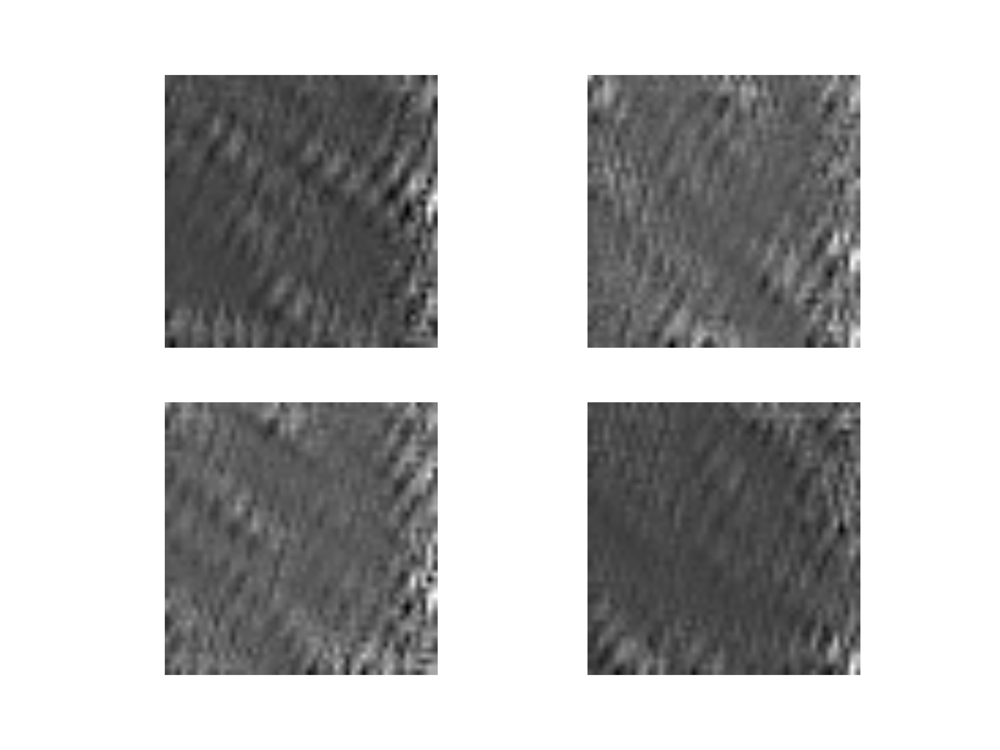
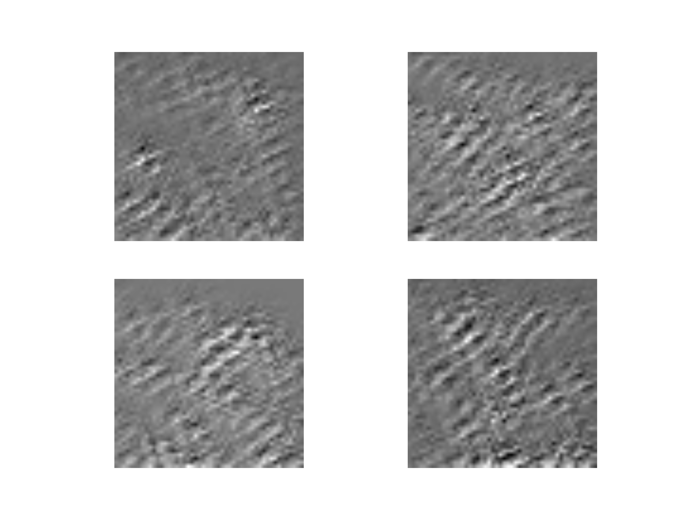
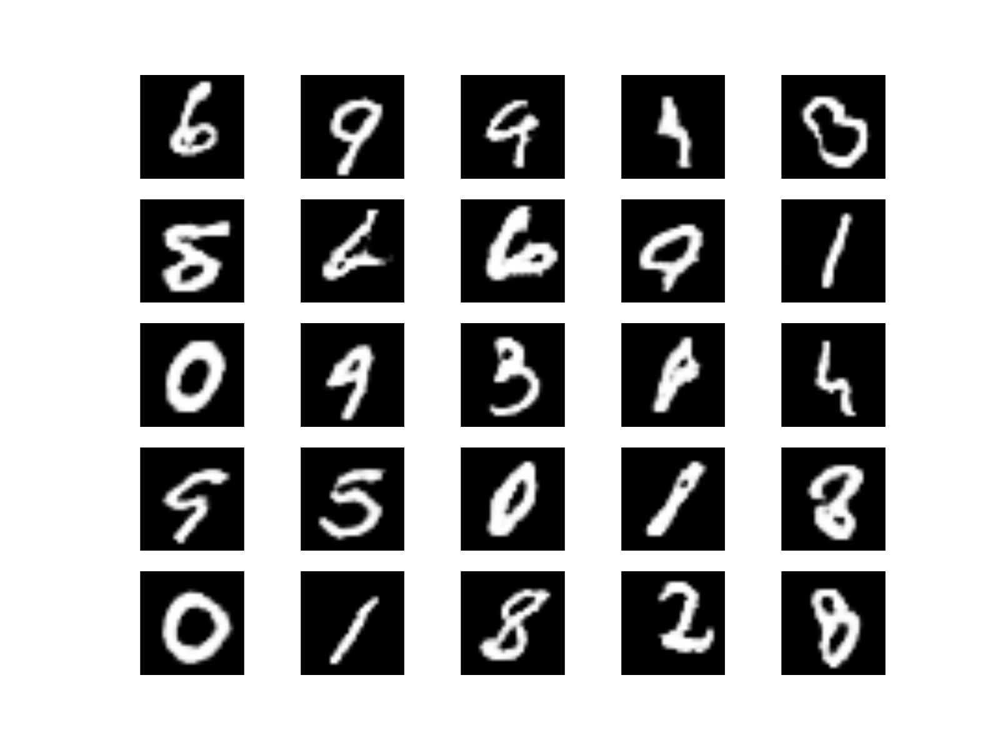

# EDGEWISE_SCALING
A modification to the traditional convolutional layer that makes a slightly more uniform initialization. Implementation is based off of [this repository](https://github.com/buriburisuri/ebgan)

___

## Motivation
I was experimenting with DCGANs a while ago and realized that edges of images generated by this model were attenuated compared with the center. Further investigation made clear that this came from zero-padding, because filters near the edges overlap with many zeros, and thus have less signal input. With all positive initialization, this results in much dimmer edges, and with zero-mean initialization, it results in edges with less variance than the center. I wanted to modify convolutional layers so they output a more uniform signal. 

___

## Methodology
* For a stride of zero and a filter-size of 5, filters centered at the corners of an image only have __9__ non-zero inputs to them, while at the center there are __25__. For zero-centered initialization, this doesn't change the mean, but it does affect the variance.
* It's more complicated with stride, and with deconvolution, because the upper-left corner may have a different number of inputs than the bottom-right corner.
* To calculate the number of non-zero inputs to each filter, I convolved an image of all ones through a filter of all ones. Since 1*1=1 (surprise surprise), the output of this told you the exact number of non-zero inputs. You do this with the same stride and filter-size you use in convolution to get your scaling-map.
* Since variance goes with the square root of the number of non-zero inputs, we take the square root of the scaling-map.
* Then, we normalize the scaling-map (divide it by its mean), so that it doesn't change the magnitude of the outputs.
* Finally, we divide the output of a regular convolutional layer by this map. In other words, for the aforementioned example, we divide the edges by sqrt(9), and the center by sqrt(25) (pre-normalization).
* Do this for each layer, and your output should be much more uniform than it would be otherwise. The same thing holds for deconvolutional layers.

___
## Code layout
* [Unscaled Deep Network](./deep_network_unscaled.py) is a bunch of stride-1 convolutional layers mapping an input to an output. I use it without training to see how the network initializes.
* [Unscaled Deep Network](./deep_network_unscaled.py) is the same thing, but with the scaling operation alongside of vanilla convolutions.
* [DCGAN_WITH_SCALING](./SAM_mnist_ebgan_train.py) trains a DCGAN with my scaling operation. [THIS FILE](./SAM_mnist_ebgan_draw_for_each_checkpoint.py) creates a set of images for each saved model. Great for tracking training progress.
* [OPS](./ops.py) has the code for the scaling operation, as well as the code for drawing the resulting images.
___

## Proof of concept
Here are side-by-side images, taken right after initialization. One is of a vanilla Deep CNN, and one is with the scaling

__SCALED__

__UNSCALED__

It's pretty subtle, but you can see that the corners on the unscaled one are more 'greywashed' than with the scaling operation

Finally, a little proof that this method can train to generate good pictures. Six epochs later, with a scaled-DCGAN:

## Future Work
Statistical analysis! I'm pretty sure the result is sound, but it would be pretty easy to confirm it with some stats.

Also, to be honest, MNIST is a pretty terrible problemn to test this on. This modification strengthens signals near the edges, but MNIST has zero signal all around the border. A better one is CIFAR, but that would have taken a lot more computational time. Nevertheless, I think the initialization pictures are evidence that it works well enough. 

Also, the effect would be more pronounced on a deeper network. That's worth a shot, but not on my hardware.
___

## Acknowledgements
First and foremost, [sugartensor](https://github.com/buriburisuri/sugartensor). It's a pretty beastly library wrapping tensorflow. Adding layers is easy, chaining is beautiful, and you don't have to worry about logging at all.
